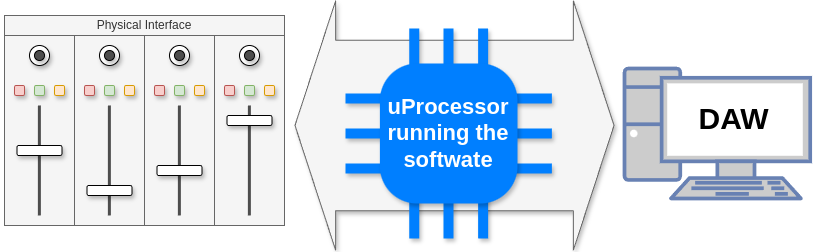
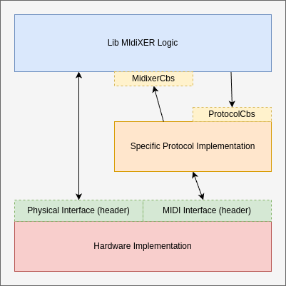

# MIdiXER Software

First of all let's take a look in a big picture of this project:

This software performs the connection between the physical interface (knobs, faders and buttons) and
the Digital Audio Workstation (DAW) in your PC.

The communication towards physical interface is implemented highly dependent on your base board
(Arduino Micro, for example) and the communication with DAW is done using MIDI protocol.

Usually the DAWs communicate to controller (in our case it is the MIdiXER Project, itself) using
a protocol **over** MIDI, that is, a protocol that uses MIDI messages to communicate, but it
attributes other meaning to the messages.

## Architecture

This project aims to implement something flexible enough to be possible to easily change the base
board and protocol, so the following architecture is proposed:

### Lib MIdiXER

It is the CORE of this project. It handles the logic and main structures that provide the features
of
MIdiXER.

It receives physical inputs from user through `Physical Interface` and from DAW through
`MidixerCbs`.

It sends physical outputs to user through `Physical Interface` and to DAW through `ProtocolCbs`.

### Specific Protocol

This portion is divided in the **header** portion and the **implementation** portion.

The **header** portion (`ProtocolCbs`) defines an interface between **implementation** and
`Lib MIdiXER`.
This interface is protocol independent and defines features from the `Lib MIdiXER` point of view
that all protocols have to implement.
Those callbacks are called by `Lib MIdiXER` and implemented by protocol.

The **implementation** portion is the protocol implementation.
It translates the MIDI messages in instructions that `Lib MIdiXER` knows and call it through
`MidixerCbs` and it translates instruction received from `Lib MIdiXER` through `ProtocolCbs` into
MIDI messages to be sent to DAW.

> **_NOTE:_**  Here is the magic. Since the **header** portion is protocol independent, we can
> implement several protocols and work with `Lib MIdiXER` without need to modify the CORE of the
> software, that is `Lib MIdiXER`.

### Physical Interface and MIDI Interface

Similar to [Specific Protocol](#specific-protocol), here we have a **header** and an
**implementation** portion where the **header** is hardware independent and the **implementation**
implements the hardware specific reading and writings to cover the *contract* described in header.

Again we can just change the Hardware Implementation to change the hardware, without need to touch
in rest of the code.

Physical interface handles buttons, faders, displays, etc.

MIDI interface handles sending and receiving MIDI messages.

## More information about the software

For more information about the software you can go to:
- [Generic MIDI](src/midi/README.md) documentation
- ~~[Lib MIdiXER](src/midixer/README.md)~~ documentation *(Not implemented yet)*
- [Mackie Control Protocol](src/proto-mcu/README.md) documentation

## Building and Testing

We have basically 2 kinds of build:
 1. **Tests Build**, where we compile for Unit Testing;
 2. **Base Board Build**, where we compile for a specific Base Board.

### Testing

To build and run tests:
 1. From inside of `software` directory
 2. Run `./build-tests.sh`
 3. Run tests: `./_build_tests/tests/test`

### Building for Arduino Micro

To build:
 1. From inside of `software` directory
 2. Run `./build-arduino-micro.sh`

To build and install:
 1. From inside of `software` directory
 2. Connect you Arduino Micro
 3. Run `./build-arduino-micro.sh /dev/ttyXXXX`