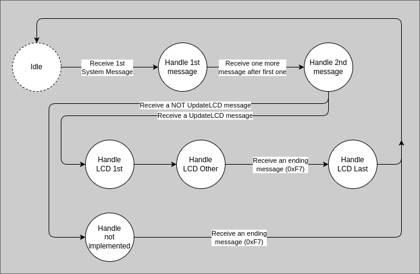

# Mackie Control Protocol

This documentations talks about the Mackie Control Protocol, or Mackie Control Universal (**MCU**),
that is the protocol used in
[Mackie Control](https://mackie.com/en/products/controllers/mcu-pro-and-xt-pro).

Unfortunately it is a proprietary protocol and there is no official documentation about it, however
there is a pretty good documentation in
[TouchMCU](https://github.com/NicoG60/TouchMCU/blob/main/doc/mackie_control_protocol.md)
repository that is very clear and easy to understand. Please go there and take a good look.

Other aspects of the protocol were discovered using reverse engineering by using
[Reaper](https://www.reaper.fm/) as DAW, configuring it to use Mackie Control Protocol and debugging
the functionalities.

This protocol is not completely implemented since (1) the overall project is not done and (2) we are
not implementing a clone of Mackie Control Surface, but a completely new product that can **MCU**
protocol to communicate to DAW.

## The classes

Some classes were created to implement the protocol.

### MidiMcuMsg

This class extends MidiMsg and it is responsible for interpreting a generic MIDI message in **MCU**
point of view.

### MackieProtocol

This is the main class of **MCU** protocol. It handles a received MidiMcuMsg, handle calls coming
from `Lib Midixer` through `ProtocolCbs` and call `Lib Midixer` through `MidixerCbs`.

### McuSystemMsgFsm

System messages could take more than 1 MIDI message to make sense, so this class is a FSM to handle
these messages.

Here is a diagram of the current implementation:

